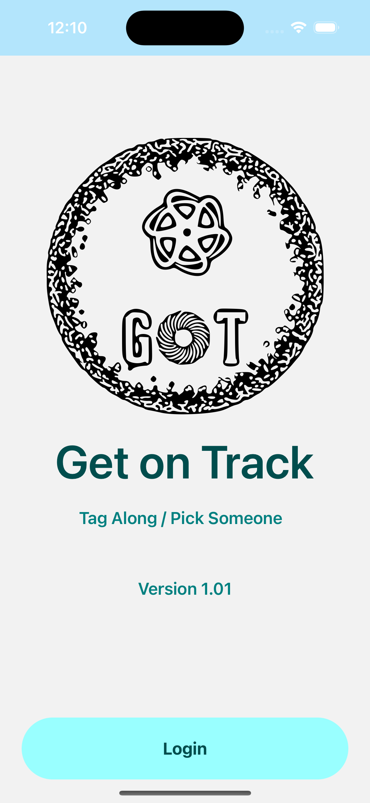
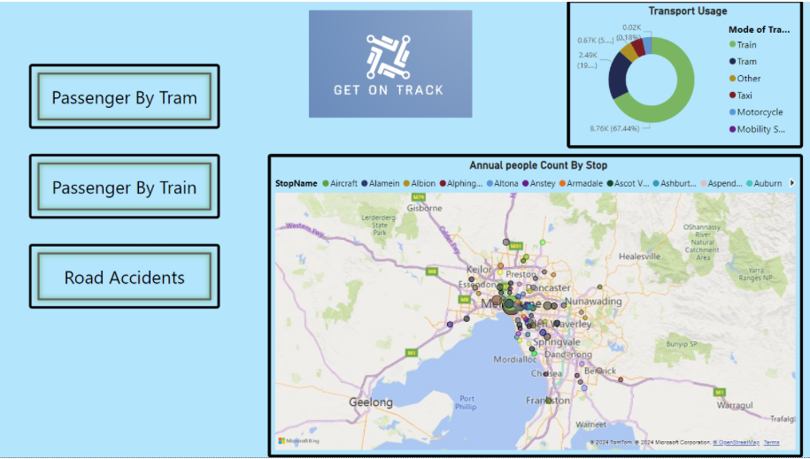
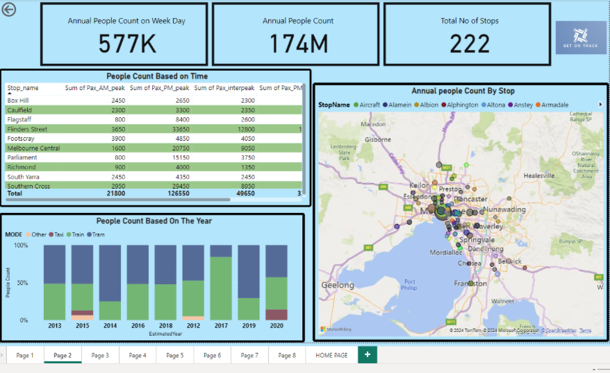
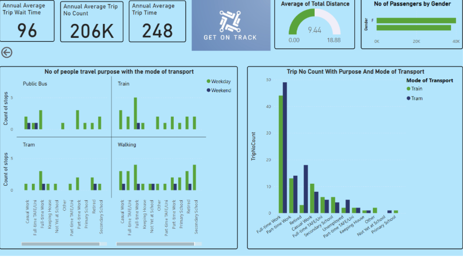

# React Native Project

A mobile application built with [React Native](https://reactnative.dev/). This project is designed to work on both Android and iOS platforms.

## Features

- Choose Pick and Drop location via GooglePlacesAutoComplete component
- Form a route betwen Pick and Drop location using Directions API
- Choose to be a rider or a tag along

## Data sets used for Dashboard

1. [Annual Regional Train Station Entries 2023-24](https://discover.data.vic.gov.au/dataset/annual-regional-train-patronage-station-entries)
2. [Annual Metropolitan Train Station Entries 2023-24](https://discover.data.vic.gov.au/dataset/annual-metropolitan-train-station-patronage-station-entries)
3. [Train Service Passenger Counts 2023-2024](https://discover.data.vic.gov.au/dataset/annual-regional-train-patronage-station-entries)
4.[Victorian Integrated Survey of Travel and Activity (VISTA)-1](https://vicroadsopendatastorehouse.vicroads.vic.gov.au/opendata/VISTA_data/VISTA_2012-20_LGA_V1/Persons_VISTA_1220_LGA_V1.csv)
5. [Victorian Integrated Survey of Travel and Activity (VISTA)-2](https://vicroadsopendatastorehouse.vicroads.vic.gov.au/opendata/VISTA_data/VISTA_2012-20_LGA_V1/Trips_VISTA_1220_LGA_V1.csv)
6. [Road Crash-1](https://vicroadsopendatastorehouse.vicroads.vic.gov.au/opendata/Road_Safety/PERSON.csv)
7. [Road Crash-2](https://vicroadsopendatastorehouse.vicroads.vic.gov.au/opendata/Road_Safety/ACCIDENT_LOCATION.csv)


## Table of Contents

- [Installation](#installation)
- [Running the App](#running-the-app)
- [Xcode Setup](#xcode-setup)
- [Android Studio Setup](#android-studio-setup)
- [Troubleshooting](#troubleshooting)
- [Dependencies](#dependencies)
- [Prerequisites](#prerequisites)
- [Demo](#demo)
- [Screenshots](#screenshots)


## Installation

Clone the repository and install dependencies:

```bash
git clone https://github.com/your-username/your-repo-name.git
cd your-repo-name
npm install
```
## Running the App

Clone the repository and install dependencies:

```bash
npx react-native start
```
To run on iOS

```bash
npx react-native run-ios
```
To run on android

```bash
npx react-native run-android
```

## Xcode Setup

1. Install Xcode from the Mac App Store.
2. Install Xcode Command Line Tools by running:

```bash
xcode-select --install
```
3. Open the project in Xcode by double-clicking the ios/YourProjectName.xcworkspace file.

## Android Studio Setup

1. Download and install Android Studio.
2. Install the Android SDK and necessary tools through the SDK Manager in Android Studio.
3. Set up an Android Virtual Device (AVD) for testing.
4. If using an actual phone, ensure developer mode is turned on. 

## Troubleshooting
1. If you encounter node_modules related issues, try deleting the folder and running npm install again.
2. For iOS build issues, try cleaning the build folder in Xcode and rebuilding.
3. For Android build issues, try cleaning the project in Android Studio and rebuilding.

## Dependencies
- react-native: ^0.70.0
- react: 18.2.0

## Prerequisites

Ensure you have the following installed:
- [Node.js](https://nodejs.org/) (which includes npm)
- [React Native CLI](https://reactnative.dev/docs/environment-setup)
- [Cocoapods](https://guides.cocoapods.org/using/getting-started.html)
- [Ruby](https://mac.install.guide/ruby/13)

To install React Native CLI globally, run:
```bash
npm install -g react-native-cli
```


## Demo 
- [Get on Track](https://youtu.be/-D8F5XhiRzQ)
- [Presentation slides](https://docs.google.com/presentation/d/1DOyUSo8E8Fkbq-nRnPq4Tx1BI8F8BptdETz1kkyijug/edit?usp=sharing)
- [Presentation video](https://youtu.be/6QWxn8E0wWU)
- [Power BI Dashboard](https://drive.google.com/file/d/1nNI3HGPZ_CAVPkNUl7QIxLdybMunQrbL/view?usp=sharing)
## Screenshots


<figure>
  
  <figcaption>Fig.1 - Login Page of the application</figcaption>
</figure>

<figure>
  
  <figcaption>Fig.2 - Landing Page of the application</figcaption>
</figure>
<figure>
  
  <figcaption>Fig.3 - Search page </figcaption>
</figure>
<figure>
  
  <figcaption>Fig.4 - Places API result based on search </figcaption>
</figure>
<figure>
  
  <figcaption>Fig.5 -Choosing Pick Location and Map </figcaption>
</figure>
<figure>
  
  <figcaption>Fig.6 - Route between Pick and Destination Location </figcaption>
</figure>
<figure>
  
  <figcaption>Fig.7 - Choose to be Rider or tag along </figcaption>
</figure>
<figure>
  
  <figcaption>Fig.8 - Page to complete as Tag along </figcaption>
</figure>
<figure>
  
  <figcaption>Fig.9 - Page to complete as Tag Along - Continued </figcaption>
</figure>
<figure>
  
  <figcaption>Fig.10 - Options to choose as a Tag Along </figcaption>
</figure>
<figure>
  
  <figcaption>Fig.11 - Page to complete as a rider</figcaption>
</figure>
<figure>
  
  <figcaption>Fig.12 - Page to complete as a rider - Completion</figcaption>
</figure>
<figure>
  
  <figcaption>Fig.13 - Bookings page</figcaption>
</figure>
<figure>
  
  <figcaption>Fig.14 - My profile page</figcaption>
</figure>
<figure>
  
  <figcaption>Fig.15 - My profile page - Scrolled Down</figcaption>
</figure>

<figure>
  
  <figcaption>Fig.16 - Power BI Home page</figcaption>
</figure>
<figure>
  
  <figcaption>Fig.17 - Power BI - Page 1 </figcaption>
</figure>
<figure>
  
  <figcaption>Fig.18 - Power BI Page 2</figcaption>
</figure>
